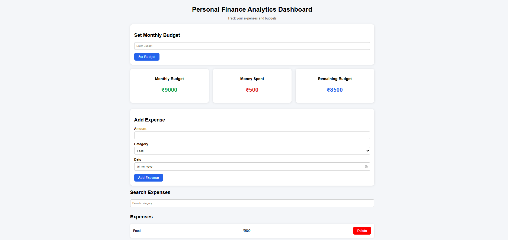
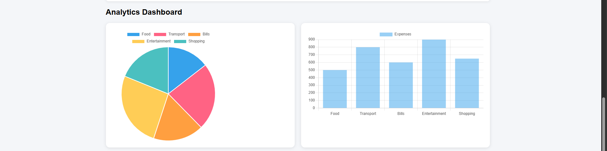

# Personal Finance Analytics Dashboard

- Developed a responsive expense tracking dashboard using HTML, CSS and JavaScript.
- Implemented budget management, expense filtering and search functionality.
- Built interactive pie and bar charts using Chart.js for financial analytics.
- Added Local Storage persistence and CSV report export capabilities.
- Deployed project using GitHub Pages.

## Features

- Add and delete expenses
- Monthly budget management
- Local Storage persistence
- Interactive Pie Chart
- Interactive Bar Chart
- Category filtering
- Expense search
- CSV export

## Technologies Used

- HTML
- CSS
- JavaScript
- Chart.js

## Screenshots

## Future Enhancements

- User Authentication
- Cloud Database
- Monthly Reports
- Expense Categories Management

## Live Demo

https://sushumnareddy.github.io/personal-finance-dashboard/
